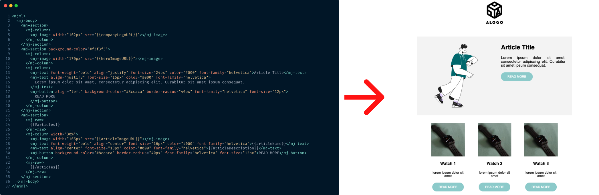
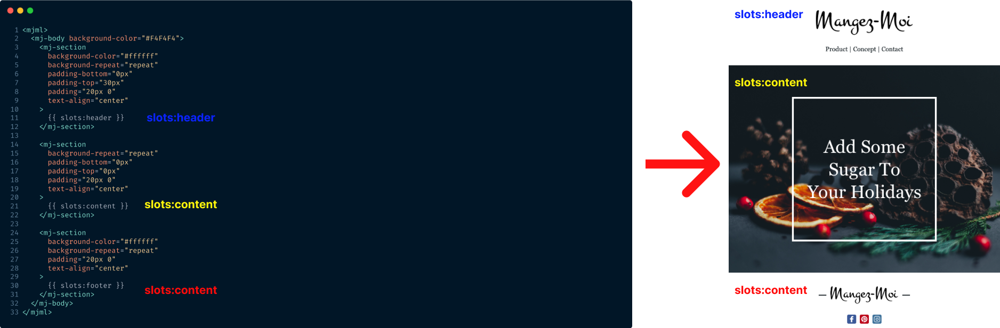

> [!WARNING]  
>Migration guide from 1.3.x to 1.4.0 can be found [here](./MIGRATION_GUIDES/FROM_1.3.X_TO_1.4.md)

<h1 align="center">
  <br>
  Nodemailer-mjml
  <br>
</h1>

<h4 align="center">
<b>nodemailer-mjml</b> is a plug-and-play solution for sending <a href="https://github.com/mjmlio/mjml"><b>MJML</b></a> mail using <a href="https://github.com/nodemailer/nodemailer"><b>nodemailer</b></a>. It not only bring a compatibility layer between <b>MJML</b> and <b>nodemailer<b> it also allow to render dynamic content using <b>mustache</b> templating

</h4>

<p align="center">
  <a href="https://badge.fury.io/js/nodemailer-mjml">
    
  </a>
  <a href="https://github.com/Thomascogez/nodemailer-mjml/actions/workflows/publish.yml"></a>
</p>

---

## Installation

```sh
yarn add nodemailer-mjml
# or using npm install nodemailer-mjml
```

## Basic usage

```ts
import { createTransport } from "nodemailer";
import { nodemailerMjmlPlugin } from "nodemailer-mjml";

const transport = createTransport({...});

// Register nodemailer-mjml to your nodemailer transport
transport.use('compile', nodemailerMjmlPlugin({/*Pass desired plugin options here*/}));

```

## Usage examples

### With template


> using `nodemailer-mjml` with a template is the simplest to start

```ts
import { createTransport } from "nodemailer";
import { nodemailerMjmlPlugin } from "../src/index";
import { join } from "path";

const transport = createTransport({
    host: "localhost",
    port: 25
});

transport.use(
    "compile",
    nodemailerMjmlPlugin({ templateFolder: join(__dirname, "mailTemplates") })
);

const sendTemplatedEmail = async () => {
    await transport.sendMail({
        from: '"John doe" <john.doe@example.com>',
        to: "doe.john@.com",
        subject: "Welcome",
        templateName: "simpleTemplate", // <- Targeted template name
        templateData: { // <- Data to be injected in the template
            companyLogoURL: "https://www.kadencewp.com/wp-content/uploads/2020/10/alogo-2.png",
            heroImageURL: "https://www.kadencewp.com/wp-content/uploads/2020/10/alogo-2.png",
            articles: [
                {
                    articleImageURL: "https://api.lorem.space/image/watch?w=150&h=150",
                    articleName: "Watch 1",
                    articleDescription: "lorem ipsum dolor sit amet",
                },
                {
                    articleImageURL: "https://api.lorem.space/image/watch?w=150&h=150",
                    articleName: "Watch 2",
                    articleDescription: "lorem ipsum dolor sit amet"
                },
                {
                    articleImageURL: "https://api.lorem.space/image/watch?w=150&h=150",
                    articleName: "Watch 3",
                    articleDescription: "lorem ipsum dolor sit amet"
                },
            ]
        },
    });
};

sendTemplatedEmail();
```

> This complete example can be found in the [examples](./examples/simpleTemplate.ts) folder

### With layout template


> Template layout allow to reuse the same layout for multiple templates

```ts
import { createTransport } from "nodemailer";
import { nodemailerMjmlPlugin } from "../src/index";
import { join } from "path";

const transport = createTransport({
    host: "localhost",
    port: 25
});

transport.use(
    "compile",
    nodemailerMjmlPlugin({ templateFolder: join(__dirname, "mailTemplates") })
);

const sendTemplatedEmail = async () => {
    await transport.sendMail({
        from: '"John doe" <john.doe@example.com>',
        to: "doe.john@.com",
        subject: "Welcome",
        templateLayoutName: "layoutTemplate",
        templateLayoutSlots: {
            header: "partials/header",
            content: "partials/content",
            footer: "partials/footer",
        },
        templateData: {
            content: {
                imageURL: "http://5vph.mj.am/img/5vph/b/1g8pi/068ys.png"
            }
        }
    });
};

sendTemplatedEmail();
```

> This complete example can be found in the [examples](./examples/layoutTemplate.ts) folder

## Documentation

### Plugin options

> Plugin options are defined by the **IPluginOptions** interface

| option                  | type               | description                                                                                                                                                                           | default                     |
| ----------------------- | ------------------ | ------------------------------------------------------------------------------------------------------------------------------------------------------------------------------------- | --------------------------- |
| templateFolder          | string             | Path of the dir containing your **MJML** template                                                                                                                                     | undefined                   |
| templatePartialsFolder? | string             | Path relative to **templateFolder**, if defined when using a template layout it will be folder where **nodemailer-mjml** while try to find fallback slots if one or more is undefined | undefined                   |
| mjmlOptions?            | MJMLParsingOptions | Options that would be passed to **MJML** compiler (see more) [mjml doc](https://github.com/mjmlio/mjml)                                                                               | {validationLevel: "strict"} |
| minifyHtmlOutput?       | boolean            | use to enable/disable html minification using **htmlnano**, if enabled make sure to install **htmlnano** as a devdependencies                                                                                                                       | false                        |
| htmlMinifierOptions?    | {options?: HtmlnanoOptions; preset?: HtmlnanoPreset}            | Options that would be passed to **htmlnano** (see more) [htmlnano doc](https://htmlnano.netlify.app/)                                                             | undefined                   |

> **nodemailer-mjml** bring 4 new params to the `sendMail` function

| options              | type   | description                                                                                                                                 | default   |
| -------------------- | ------ | ------------------------------------------------------------------------------------------------------------------------------------------- | --------- |
| templateName?        | string | Name of the file relative to **templateFolder** (without extension) corresponding to your template                                          | undefined |
| templateLayoutName?  | string | Name of the file relative to **templateFolder** (without extension) corresponding to your template layout file                              | undefined |
| templateLayoutSlots? | Object | Object containing path of partial file relative to **templateFolder** (without extension) that will be injected to the corresponding slot   | undefined |
| templateData?        | Object | Object containing data that would be used by mustache template compiler                                                                     | undefined |

## Tests

> This plugin, have multiple tests suites (unit, integration) to ensure that everything is working as expected
> You can run the tests locally by running the following command

```sh
# watch mode
docker compose run --rm tests yarn test:watch
#single run
docker compose run --rm tests yarn test
```

## Credit

This software uses the following open source packages:

- [MJML](https://github.com/mjmlio/)
- [nodemailer](https://github.com/nodemailer/nodemailer)
- [mustache](https://www.npmjs.com/package/mustache)
- [html-minifier](https://www.npmjs.com/package/html-minifier)

## Contributing

All contributions are welcome 🫡
